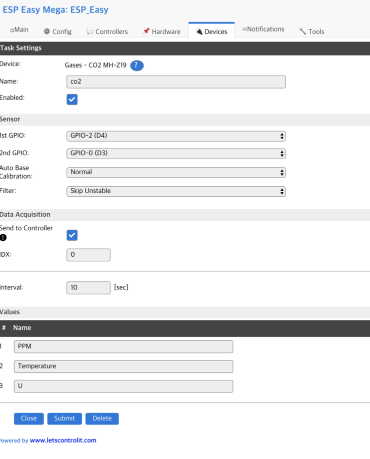
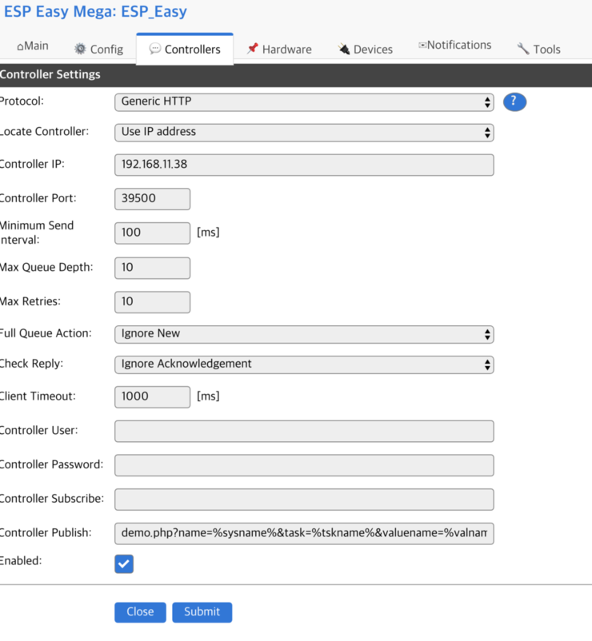
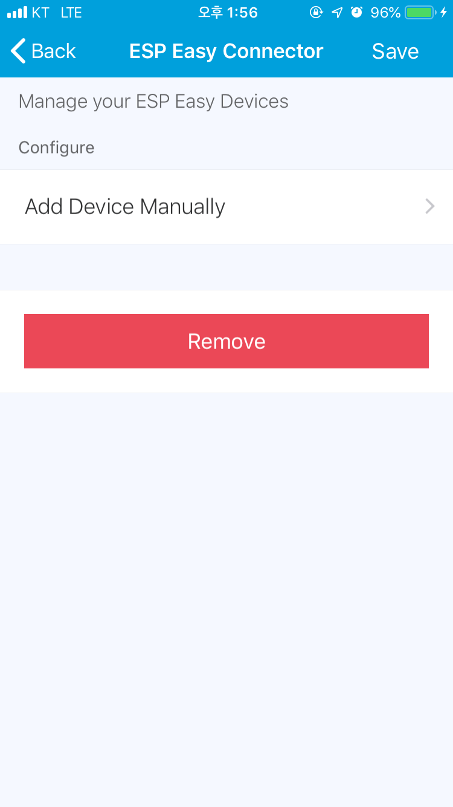
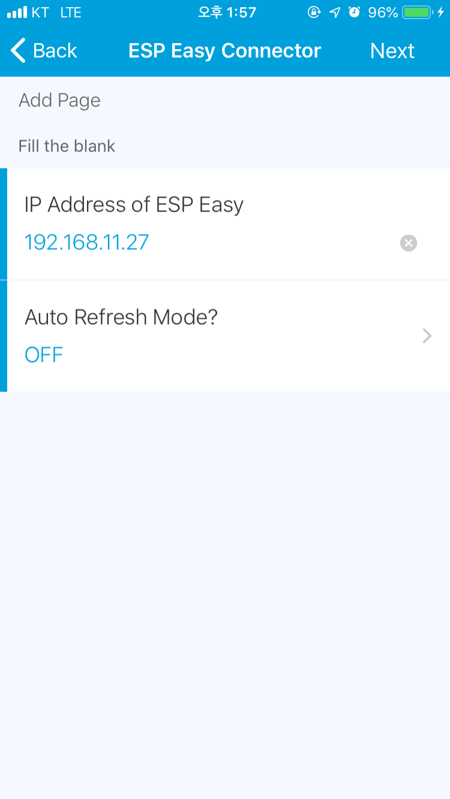
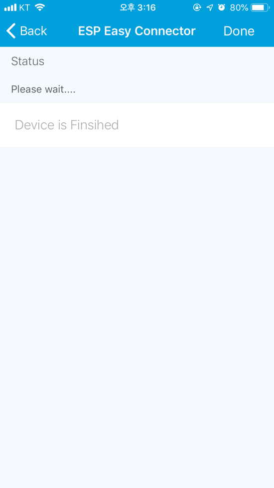
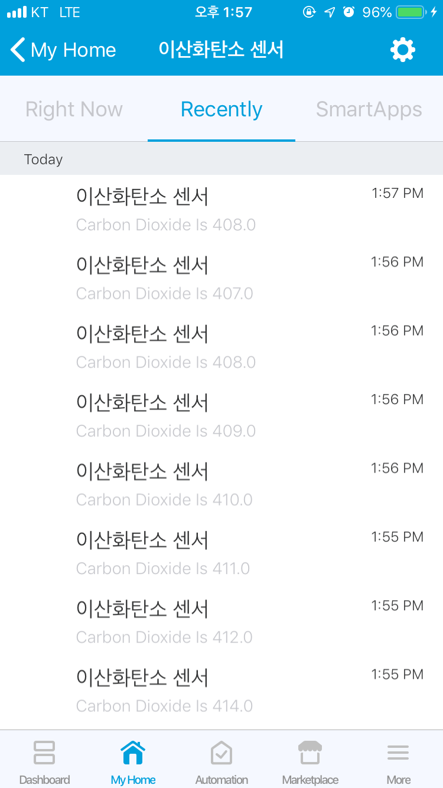

# EspEasy-Connector
Connector for EspEasy with Smartthings


## Install DTH<br/>
```
Go to the Smartthings IDE
Click My Device Handlers
Click Create New Device Handlers
Copy content of file in the devicetypes/fison67 folder to the area
```
<br/><br/>

## Install Smartapps<br/>
```
Connect to the Smartthings IDE
Click My Smartapps
Click New Smartapp
Click From Code 
Copy content of mi_connector.groovy & Paste
Click Create
```

## Setup Esp Easy
```
Go to {Devices} tab.
Enable [Send to Contrller]
Enable [Enabled] check box.
Don't modify name of [Values]
It's to be keep these values 'Temperature', 'Humidity', 'Lux', 'Color Temperature', 'PPM', 'Dust'
Cuz Smartthings DTH recognize sensor type by that values.

Go to {Controller} tab.
Set Controller IP to your Smartthings Hub IP.
Set Controller Port to 39500
Enable [Enabled] check box.
```












## Mode
Auto Refresh On : Smartthings DTH is getting status of ESP EASY by scheduling.
                  Disable [Enabled] on Controller tab of ESP EASY. 
Auto Refresh Off : ESP EASY send to status Smartthings Hub.
                  Enable [Enabled] on Controller tab of ESP EASY. 
